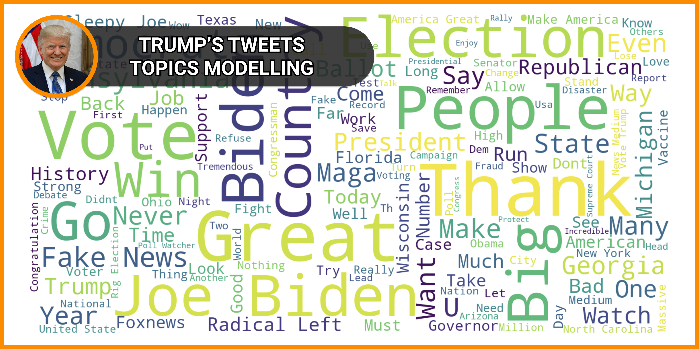

# Trump Tweets Topic modelling

Natural Language Processing (NLP) project.

Using Term Frequency-Inverse Document Frequency (TF-IDF), I performed a topic modelling on the tweets of Donald Trump from July 19th to December 16th.
The dataset is orinated from [Kaggel](https://www.kaggle.com/gpreda/trump-tweets).

Here are the steps that I followed:
- Step 1: Read the dataset
- Step 2: Explore the dataset
- Step 3: Clean the dataset
- Step 4: Tokenization
- step 5: Stopwords removal
- step 6: Lemmatization
- step 7: Topic modelling
